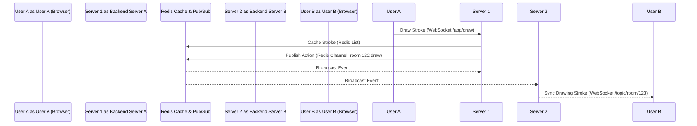

# SyncBoard

SyncBoard is a premium, low-latency, real-time collaborative drawing whiteboard application. Multiple users can join a shared session using a 6-digit room code, draw freehand and vector shapes, view live mouse cursors labeled with usernames, undo stroke transactions, and persist their workspaces permanently.

---

## Key Features

- **Real-Time Collaboration**: Dynamic synchronizations of drawing strokes and shape vectors powered by Spring Boot WebSockets (STOMP over SockJS) and Redis Pub/Sub.
- **Active Cursors Overlay**: Floating, custom-colored indicators showing peer cursors in real-time, throttled to **35ms** (approx. 30 FPS) to optimize network bandwidth.
- **High-DPI Render Canvas**: Scaled drawing context mapping to logical `1920x1080` dimensions using the browser's `devicePixelRatio` to prevent blurry lines on Retina/4K screens.
- **Smart Shape Fills**: Supports Pen (freehand), Line, Rectangle, and Circle vector tools. Rectangles and circles feature a premium **25% transparent fill** toggle matching the stroke color.
- **Transactional Undo**: A single click on the **Undo** button erases the entire line drawn between pressing the mouse down and releasing it (rather than tiny segment pixels).
- **Active Users Sidebar**: Real-time list of online drawer usernames. A `SessionDisconnectEvent` listener automatically clears active users in Redis if they close the tab.
- **Workspace Exporter**: Offscreen canvas compiler that overlays drawings onto a slate-900 background to export clean, high-resolution `.png` downloads.
- **Database Persistence**: Click-to-save button commits the transient drawing list from Redis to PostgreSQL for long-term reloads.

---

## Technology Stack

### Backend
- **Core**: Java 21 / 26 + Spring Boot 3.3.0 (Spring MVC)
- **Real-time**: Spring WebSocket (STOMP protocol) & SockJS fallback
- **Broker & Cache**: Redis (Spring Data Redis) for dynamic room synchronization and pub/sub scaling
- **Database**: PostgreSQL (Spring Data JPA) for workspace persistence
- **Local Cache**: Embedded Redis Server (`com.github.codemonstur:embedded-redis`) for dockerless local bootup

### Frontend
- **Framework**: React 19 + Vite 5 (downgraded for Native binary WDAC compatibility)
- **Styling**: Vanilla CSS (Tailwind compatible) featuring glassmorphic panel overlays and custom glowing layouts
- **Drawing**: HTML5 Canvas API with Logical Viewport scaling
- **Icons**: Lucide React

---

## System Architecture

The monorepo contains a separate `backend` (Spring Boot) and `frontend` (React Vite) directory, synchronized via Redis Pub/Sub to support horizontal scaling across clustered server nodes:



---

## Local Setup & Installation

### Prerequisites
- **Java JDK 21+** (e.g., Eclipse Temurin or Oracle JDK)
- **Node.js** (v18+ recommended)
- **PostgreSQL** running locally on port `5432`

---

### 1. Database Setup
1. Log in to your local PostgreSQL instance and create a database named `syncboard`:
   ```sql
   CREATE DATABASE syncboard;
   ```
2. The database password defaults to `MGbrothers` (you can configure this inside [`application.properties`](backend/src/main/resources/application.properties)).

---

### 2. Run the Spring Boot Backend
The backend utilizes an automatic **Embedded Redis Server** that spins up on port `6379` if it detects that the port is free, removing the need to install or run Redis locally.

1. Navigate to the `backend/` directory:
   ```bash
   cd backend
   ```
2. Build and run the Spring Boot application using Maven:
   ```bash
   mvn spring-boot:run
   ```
3. The server will start on **http://localhost:8080** and create the database schema automatically.

---

### 3. Run the React Frontend
1. Navigate to the `frontend/` directory:
   ```bash
   cd ../frontend
   ```
2. Install npm dependencies:
   ```bash
   npm install
   ```
3. Start the Vite development server:
   ```bash
   npm run dev
   ```
4. Open **http://localhost:5173** in your web browser.
